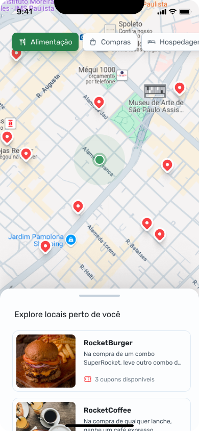

# Nearby

|  |  |  |  |  |
| ---------------------------- | ---------------------------- | ---------------------------- | ---------------------------- | ---------------------------- |
| Splash                       | Start                        | Home                         | Home List                    | Details                      |

<br />

## About the project

Nearby is a benefits club mobile app with coupons to use at establishments near you.

---

## :rocket: Technologies

This project was developed with the following technologies:

- Server

  - [x] [Node.js](https://nodejs.org)
  - [x] [Express](https://expressjs.com)
  - [x] [Zod](https://zod.dev)
  - [x] [Prisma](https://www.prisma.io)
  - [x] [SQLite](https://www.sqlite.org)

- Mobile

  - [x] [Kotlin](https://kotlinlang.org)
  - [x] [Jetpack Compose](https://developer.android.com/compose)
  - [x] [Maps compose](https://developers.google.com/maps/documentation/android-sdk/maps-compose)
  - [x] [Ktor](https://ktor.io)

## :gear: Execute

First clone this repository:

```bash
$ git clone https://github.com/Sup3r-Us3r/nearby.git
$ cd nearby
```

### Server

```bash
$ cd nearby-api
$ npm i
$ npm run start
```

### Mobile

#### Add Google API KEY

You need to create an API key in [GPC](https://console.cloud.google.com) and add it to [AndroidManifest](./Nearby/app/src/main/AndroidManifest.xml) on line 35.

> APIs & Services -> Credentials -> + Create Credentials -> API Key

```xml
<meta-data
  android:name="com.google.android.geo.API_KEY"
  android:value="YOUR KEY" />
```

#### Add Physical Device IP

To test the barcode reading part, the only way is through the physical device, so to do this, get the local IP of your Android and add it to the variable below:

File [NearbyRemoteDataSource](./Nearby/app/src/main/java/me/mayderson/nearby/core/network/NearbyRemoteDataSource.kt).

```kt
private const val LOCAL_HOST_PHYSICAL_BASE_URL = "http://"
```

> e.g: "http://192.168.2.3"

### Run APP

Open the Nearby folder in Android Studio and run the application.

## :nail_care: Layout

You can see the mobile layout in Figma with this [link](https://www.figma.com/community/file/1448070647757721748).

## :memo: License

This project is under the [MIT license](./LICENSE).
